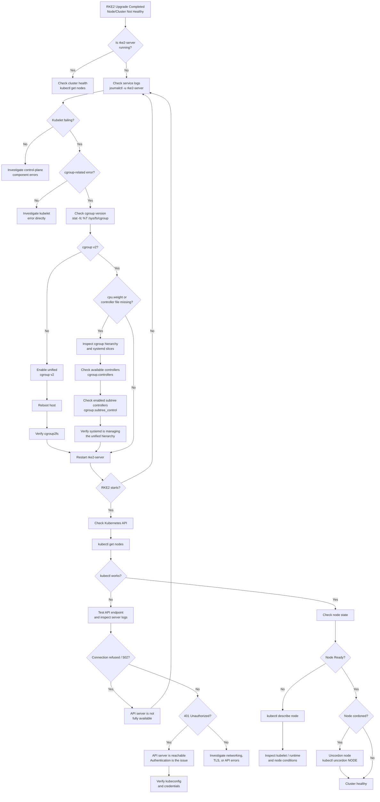

# RKE2 Upgrade Troubleshooting Guide

This guide captures a practical troubleshooting flow for rolling RKE2 upgrades, especially when moving through newer Kubernetes versions where host-level requirements such as cgroup v2 can become upgrade blockers.

## Troubleshooting Tree



## Common Symptoms

| Symptom | First check | Likely issue | Recommended action |
|---|---|---|---|
| `rke2-server` fails after upgrade | `journalctl -u rke2-server -b` | Kubelet or control-plane startup failure | Find the first underlying kubelet/control-plane error |
| Kubelet says cgroup v1 is unsupported | `stat -fc %T /sys/fs/cgroup` | Host is still using cgroup v1 | Enable unified cgroup v2, reboot, and verify again |
| `cpu.weight` is missing | Inspect `/sys/fs/cgroup`, systemd slices, and `cgroup.controllers` | cgroup v2 hierarchy/controllers are not configured as expected | Verify systemd unified hierarchy and controller delegation |
| RKE2 starts but `kubectl` fails | Check API endpoint and RKE2 logs | API server may still be starting or failing | Diagnose the API server before troubleshooting workloads |
| `curl` returns `502` or connection refused | RKE2/API logs | API server is not accepting connections | Fix the control-plane startup issue |
| `curl` returns `401` | API endpoint | API server is reachable but authentication failed | Check kubeconfig, token, and certificates |
| Node is `Ready` but pods are not scheduling | `kubectl get nodes` | Node may still be cordoned after rolling maintenance | Run `kubectl uncordon <node>` |

## Recommended Troubleshooting Order

Use this order to avoid chasing downstream symptoms before the underlying platform is healthy:

**Host → RKE2 service → Kubelet → cgroup v2 → API server → node health → cordon state → healthy cluster**

## Useful Commands

```bash
# RKE2 service state
systemctl status rke2-server

# RKE2 server logs
journalctl -u rke2-server -b

# Check cgroup filesystem type
stat -fc %T /sys/fs/cgroup

# Available cgroup v2 controllers
cat /sys/fs/cgroup/cgroup.controllers

# Enabled subtree controllers
cat /sys/fs/cgroup/cgroup.subtree_control

# Kubernetes node state
kubectl get nodes -o wide

# Detailed node conditions
kubectl describe node <node>

# Restore scheduling after maintenance
kubectl uncordon <node>
```

## Notes

This guide intentionally focuses on reusable RKE2 and Kubernetes upgrade troubleshooting rather than environment-specific image or architecture mistakes.
